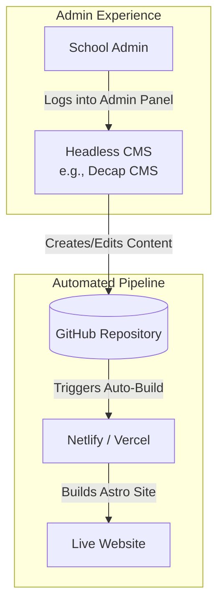

# Air Force School Avadi - Architecture & Maintenance Guide

This document provides a comprehensive overview of the website's architecture, step-by-step instructions for manual updates (like adding notices or photos), and a roadmap for adding future backend capabilities like a CMS.

---

## 1. Current Architecture (Static Site Generation)

Currently, the website is built using **Astro**, a modern Static Site Generator (SSG), paired with **TailwindCSS** for styling. 

It does not have a traditional "live" database (like MySQL or MongoDB). Instead, it uses a file-based approach. When the website is built (deployed), Astro combines your data files (JSON), images, and UI templates into highly optimized, lightning-fast static HTML pages.

### Architectural Diagram

```mermaid
flowchart TD
    subgraph Data Sources
        JSON[src/data/notices.json\n(Notices Data)]
        Images[public/Gallery/\n(Photos)]
        Content[src/pages/*.astro\n(Page Content)]
    end

    subgraph Build Process
        Astro[Astro Build Engine\n+ TailwindCSS]
    end

    subgraph Production Website
        HTML[Optimized HTML\nCSS & JS]
        CDN[Hosting CDN\ne.g., Netlify / GitHub Pages]
    end

    JSON --> Astro
    Images --> Astro
    Content --> Astro
    Astro -- Generates --> HTML
    HTML --> CDN
```

**Why this approach?**
- **Unbeatable Speed & Security:** Since there is no active database connected to the live site, it is virtually impossible to hack via SQL injection. The pages load instantly.
- **Zero Hosting Costs:** Static sites can be hosted for free on platforms like Netlify, Vercel, or GitHub Pages.

---

## 2. How to Make Manual Changes

You can update dynamic parts of the website without knowing HTML or CSS.

### A. Publishing New Notices & Circulars

The notices page is driven entirely by a JSON data file.

1. Open the file `src/data/notices.json`.
2. You will see a list of items enclosed in `{}`. To add a new notice, add a new block at the top of the list.
3. Follow this template:

```json
{
  "id": 99,
  "date": "2026-06-15",
  "title": "Quarterly Examinations Schedule 2026",
  "category": "exam",
  "isNew": true,
  "link": "/images/exam_schedule.pdf"
}
```

* **id:** Give it a unique number.
* **date:** Format as `YYYY-MM-DD`.
* **category:** Must be one of: `admission`, `academic`, `circular`, `exam`, `general`.
* **isNew:** Set to `true` to show the blinking "NEW" badge, or `false` to hide it.
* **link:** The path to the file. Upload your PDF to the `public/images/` folder first, then link it here. (Use `null` if there is no file to download).

### B. Adding New Photos to the Gallery

The Gallery page is built to **automatically scan folders** and display the images. You don't need to write any code to add photos!

1. Navigate to the `public/Gallery/` folder or `public/Infrastructure/` folder.
2. To add photos to the **Events 2026** tab, just drop your `.jpg` or `.png` files into `public/Gallery/Gallery_2026/`.
3. To add photos to the **Fit India** tab, drop them into `public/Gallery/Fit India 23-24/`.
4. *Note: Ensure your image names don't contain special characters. Keep file sizes small (under 500KB) for fast loading.*

### C. Updating Text Content (e.g., About Us, Principal's Message)

1. Open the relevant file in `src/pages/` (e.g., `src/pages/about.astro`).
2. Scroll past the code at the top (between the `---` lines).
3. Find the text you want to change inside the HTML tags (like `<p>` or `<h1>`) and simply type your new text.

---

## 3. Future Roadmap: Adding a "Real" Backend (CMS)

If you hand this project over to school administrators who do not know how to use Git or code editors, you will want to add a **Content Management System (CMS)**. 

Because we used Astro, you don't need to rebuild the site. You can easily plug in a "Headless CMS". 

### Recommended Headless CMS Options:
1. **Decap CMS (formerly Netlify CMS) - *Highly Recommended***: Completely free, integrates directly with your GitHub repo. Staff get a nice login screen (e.g., `afschoolavadi.com/admin`) to write notices and upload photos. When they click "Publish", it automatically updates the JSON files and redeploys the site.
2. **Sanity.io or Strapi**: More advanced, requires API fetching, but offers incredibly powerful enterprise-grade content modeling.

### How a CMS Architecture Works



### Steps to Implement Decap CMS (The simplest upgrade):
1. Create a `public/admin/index.html` and `public/admin/config.yml` file.
2. In the `config.yml`, define the "Collections" mapping to your `src/data/notices.json`.
3. Enable Netlify Identity to allow school staff to log in with an email and password.
4. **Result:** Staff get a beautiful dashboard to manage notices and gallery images without ever seeing code.

---

## 4. Summary of Tech Stack

- **Framework:** Astro 6.x (Chosen for Zero-JS by default, insanely fast load times).
- **Styling:** TailwindCSS v4 (Utility-first CSS, allows rapid UI changes without messy stylesheets).
- **Hosting:** Ready for Netlify, Vercel, or GitHub Pages.
- **Form Handling:** Formspree is integrated into the Contact Us page. (Just replace the `YOUR_FORM_ID` in `src/pages/contact.astro` with an actual Formspree ID).
